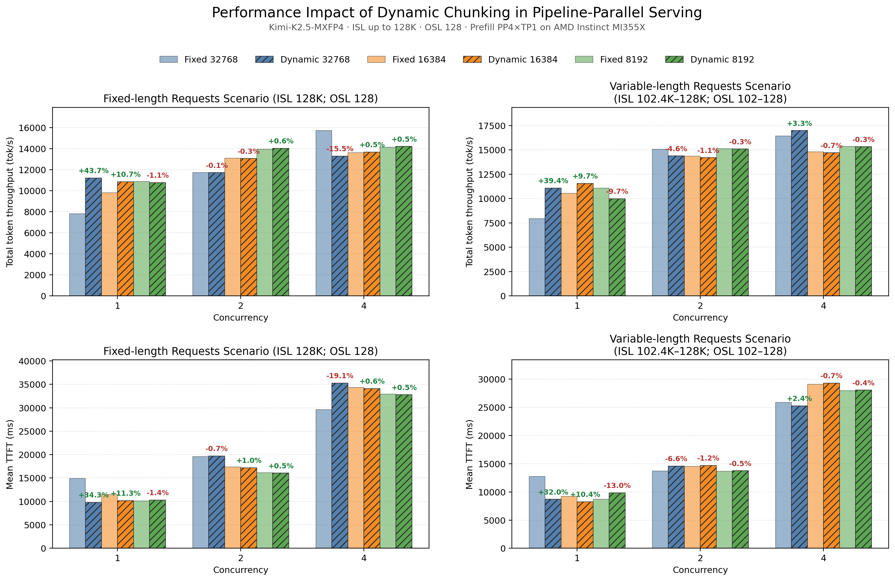
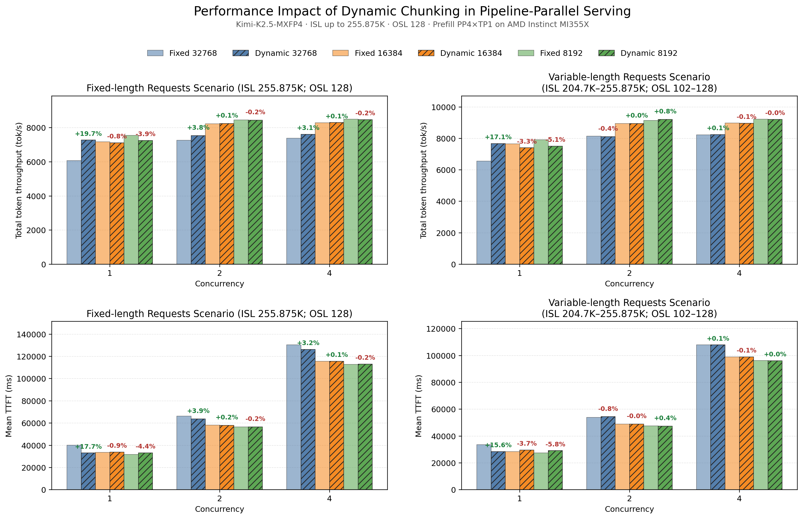

# Dynamic Chunked Pipeline Parallel

Dynamic Chunked Pipeline Parallel (Dynamic CPP) reduces Time to First Token (TTFT) for long prompts on pipeline-parallel prefill workers. It changes the prefill chunk size as the cached prefix grows so that consecutive pipeline microbatches take similar time, reducing pipeline fill, drain, and stage-misalignment bubbles.

Dynamic CPP is intended for latency-bound, low-concurrency long-context prefill. In a Prefill-Decode (PD) disaggregated deployment, enable it only on the prefill worker.

## How it works

With fixed chunking, a chunk becomes slower as more tokens precede it because self-attention covers a larger area. MLA models may also rebuild cached-prefix state once per chunk. ATOM models the latency of a chunk of `x` new tokens after a cached prefix of `L` tokens as:

```text
t(L, x) = c + gamma * L + b * x + a * (2 * L * x + x^2)
```

- `L` is the cached-prefix length, `x` is the number of new tokens in the current chunk, and `t(L, x)` is the predicted chunk latency.
- `c + gamma * L` represents overhead independent of the current chunk size: `c` is the fixed per-forward overhead, while `gamma * L` captures prefix-dependent work such as rebuilding cached-prefix state in MLA models.
    - These terms remain separate because they scale differently with `L`: `c` is paid even when `L = 0`, whereas `gamma * L` is zero at `L = 0` and grows with the cached prefix. Treating both as one constant would lose this prefix-dependent behavior.
- `b * x` captures work that grows linearly with the new-token count.
- `a * (2 * L * x + x^2)` models self-attention work: `2 * L * x` represents interactions between the new chunk and its cached prefix, while `x^2` represents interactions within the new chunk.
- `a`, `b`, `c`, and `gamma` are learned automatically from measured forward latency.

The scheduler solves for the next `x` whose latency matches the initial chunk, then applies the smoothing factor, minimum chunk size, batch-token budget, and alignment to `max(KV block size, 64)`.

ATOM calibrates the model automatically:

1. At startup, 24 attention-free dummy forwards fit the per-token and fixed overheads (`b` and `c`).
2. During the first few single-prefill requests, the scheduler alternates between `--max-num-batched-tokens` and one quarter of that size. Real forward timings fit the attention-area, cached-prefix, and serving overhead terms.
3. Samples use non-blocking GPU events, are reduced by median per `(chunk, prefix)` shape, and must pass residual, matrix-conditioning, and prediction-uncertainty checks.
4. The accepted model is installed once and timing stops. If calibration is unusable or predicts no useful shrink, ATOM keeps fixed chunking.

No offline coefficients or calibration flags are required.

## Enable

```bash
python3 -m atom.entrypoints.openai_server \
  --model <model-path> \
  --pipeline-parallel-size 4 \
  --tensor-parallel-size 1 \
  --enable_chunked_prefill \
  --max-model-len 262144 \
  --max-num-batched-tokens 32768 \
  --enable-dynamic-chunking \
  --dynamic-chunking-smooth-factor 0.75 \
  --dynamic-chunking-min-chunk-size 4096
```

`--enable_chunked_prefill` is enabled by default. Dynamic CPP additionally requires `--pipeline-parallel-size > 1`.

The main controls are:

- `--max-num-batched-tokens`: global scheduling token budget and the reference/maximum chunk size for Dynamic CPP. Start with 2-3x the best fixed chunk size, and consider 4x for very long prompts; benchmark the target workload because the optimum is model- and topology-dependent.
- `--dynamic-chunking-smooth-factor`: interpolation between the initial chunk (`0`) and the fitted equal-latency chunk (`1`). The default is `0.75`; `0.6-0.85` is a practical tuning range.
- `--dynamic-chunking-min-chunk-size`: lower bound for solved chunks, default `4096`.

Use single-request warmup traffic so automatic calibration completes before measurement or production traffic.

## Runtime behavior and limits

- Dynamic sizing is used only while one request is the pipeline's sole recent prefill source. With concurrent prefills, ATOM keeps the configured fixed chunk size because other requests already fill pipeline bubbles and extra chunks only add forward and cached-prefix overhead.
- The optimization targets long-prefill TTFT, not decode performance.
- The best initial chunk and smoothing factor remain model-, hardware-, prompt-, and PP-topology-dependent.
- Uneven PP layer partitions can perform better with the larger partition on a later stage, for example `15,15,15,16`.

## Performance summary

The results reported in [ATOM PR #2007](https://github.com/ROCm/ATOM/pull/2007) use Kimi-K2.5-MXFP4 on MI355X with disaggregated prefill PP4xTP1, decode TP4, OSL 128, and fixed- or variable-length 128K/256K prompts. Each pair below is throughput change / mean TTFT improvement; positive values mean Dynamic CPP wins.

### Fixed and variable-length requests up to 128K



### Fixed and variable-length requests up to 256K



- Against the best tuned fixed chunk across 8K/16K/32K, Dynamic CPP at concurrency 1 improves 128K fixed-length traffic by `+2.9% / +3.3%` and 128K variable-length traffic by `+4.3% / +4.9%`; at 256K it trails the tuned fixed baseline by about `3-4%`.
- Against the default `--max-num-batched-tokens=16384`, concurrency-1 gains at 128K are `+10.7% / +11.3%` for fixed-length and `+9.7% / +10.4%` for variable-length traffic; 256K and higher-concurrency results are mostly flat to modestly negative, with the largest regression at `-3.3% / -3.7%`.
- Against a 32K fixed chunk, concurrency-1 gains are `+43.7% / +34.3%` for 128K fixed-length, `+39.4% / +32.0%` for 128K variable-length, `+19.7% / +17.7%` for 256K fixed-length, and `+17.1% / +15.6%` for 256K variable-length traffic.
- At higher concurrency the gains are workload-dependent and can regress, including `-15.5% / -19.1%` for 128K fixed-length traffic at concurrency 4 with a 32K baseline.

Overall, Dynamic CPP primarily reduces the sensitivity of a large initial chunk to tuning for long-context, low-concurrency workloads; it does not outperform the best fixed chunk in every workload.

## Accuracy and correctness

The same PR evaluates GSM8K 3-shot accuracy over 1319 samples with a 512-token budget that forces multi-chunk prefill:

- 1107 requests exercised the multi-chunk path.
- Fixed and dynamic chunking both completed `1319/1319` requests without timeouts, crashes, or KV handoff failures.
- Flexible exact match changed from `92.72%` to `93.56%`, and strict exact match changed from `92.57%` to `93.48%`.

The small accuracy difference is within run-to-run noise, showing no accuracy regression from Dynamic CPP.

## References

- [SGLang: Pipeline Parallelism for Long Context](https://github.com/sgl-project/sglang/blob/main/docs/docs/advanced_features/pipeline_parallelism.mdx)
- [LMSYS: Pipeline Parallelism in SGLang](https://www.lmsys.org/blog/2026-01-15-chunked-pipeline/#3-advanced-option-dynamic-chunking)
- [vLLM-Ascend Dynamic CPP design](https://docs.vllm.ai/projects/ascend/en/latest/developer_guide/Design_Documents/dynamic_chunked_pipeline_parallel.html)
- [vLLM-Ascend Dynamic CPP feature guide](https://docs.vllm.ai/projects/ascend/en/latest/user_guide/feature_guide/dynamic_chunk_pipeline_parallel.html)
